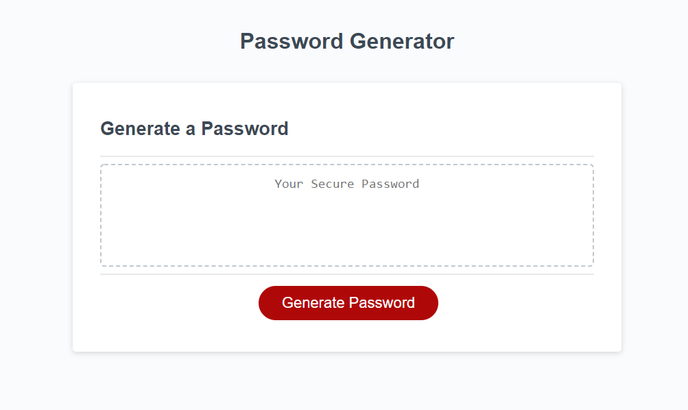

# password-gen
This is an application that will generate a password string based on user input for password criteria. The user can select from numeric, uppercase letters, lowercase letters and special characters.  

